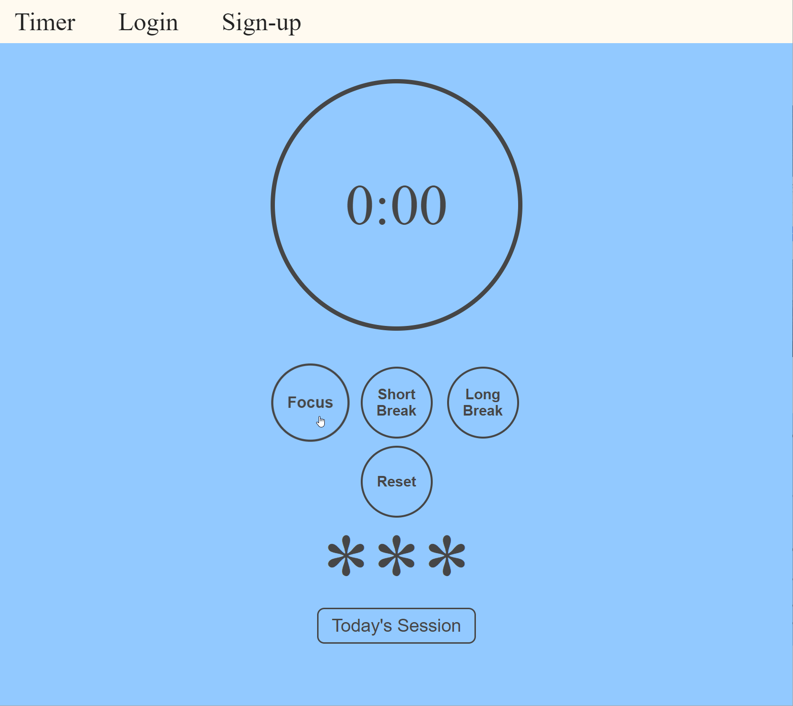
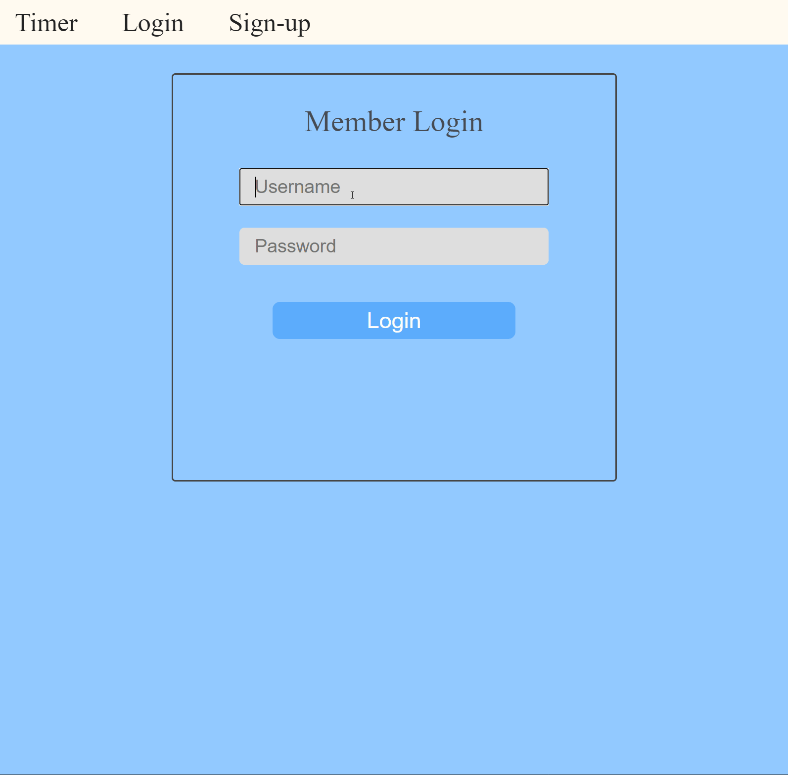

# Pomodoro Technique Timer

### Table of Contents

- [Description](#description)
- [Demo](#demo)
- [License](#license)
- [Author Info](#author-info)

---

## Description

This is an app I created to simulate the Pomodoro Technique that people use while studying or needing to focus for an extended period of time. The app features a standard timer that has 3 different time settings to choose from which include focus (25 minutes), short break (5 minutes), and long break (10 minutes). The idea is that the user will focus for 25 minutes before taking a short break (5 minutes) and repeat the cycle for as long as needed while taking a long break after every 4 cycles or so. 

I also implemented a signup/login feature for users to be able to save their daily progress and track results from past dates. All data is stored on a MongoDB database along with the usernames and passwords. 

## Technology/Tools Used

- JavaScript
- EJS
- Node.js
- MongoDB
- Mongoose
- SCSS
- Bcrypt
- Client-Sessions

## Inspiration 

As someone who constantly battles with being distracted with everything while at home, I used the Pomodoro technique for a long time when I began teaching myself computer programming. I found that breaking study sessions into 25-minute mini-sessions made it way easier to not get distracted as often. I even took it a step further and would actually mark a little asterisk on a piece of grid paper next to the date in order to challenge myself to study just a little longer each day.

So that’s what gave me the inspiration for this project. I knew how helpful it was for me in the beginning and figured maybe someone else might want to try it out someday. That’s also why I decided to add the login feature so users could save their daily progress and challenge themselves to study just a bit longer each day.

## Notes 

My goal is to redesign this app at some point. Right now it has a very basic design becuase I was more focused on the functionality. Check back in later for a more updated modern design. 

## URL

The app is currently hosted on a Heroku server and will take some time to load but should not take more than a minute to start up. 

https://pomo-focus-timer.herokuapp.com/
---
# Demo

### Basic timer functionality demo below

### Login feature with user dashboard display below

 - [Back To The Top](#pomodoro-technique-timer)

 ## License 

 MIT License 

 Copyright 2021 Jake Januszanis

Permission is hereby granted, free of charge, to any person obtaining a copy of this software and associated documentation files (the "Software"), to deal in the Software without restriction, including without limitation the rights to use, copy, modify, merge, publish, distribute, sublicense, and/or sell copies of the Software, and to permit persons to whom the Software is furnished to do so, subject to the following conditions:

The above copyright notice and this permission notice shall be included in all copies or substantial portions of the Software.

THE SOFTWARE IS PROVIDED "AS IS", WITHOUT WARRANTY OF ANY KIND, EXPRESS OR IMPLIED, INCLUDING BUT NOT LIMITED TO THE WARRANTIES OF MERCHANTABILITY, FITNESS FOR A PARTICULAR PURPOSE AND NONINFRINGEMENT. IN NO EVENT SHALL THE AUTHORS OR COPYRIGHT HOLDERS BE LIABLE FOR ANY CLAIM, DAMAGES OR OTHER LIABILITY, WHETHER IN AN ACTION OF CONTRACT, TORT OR OTHERWISE, ARISING FROM, OUT OF OR IN CONNECTION WITH THE SOFTWARE OR THE USE OR OTHER DEALINGS IN THE SOFTWARE.

[Back To The Top](#pomodoro-technique-timer)

---

## Author Info 

- Website - [Jake Januszanis](http://jakejanuszanis.com)
- Linkedin - [@jakejanuszanis](https://www.linkedin.com/in/jake-januszanis/)

[Back To The Top](#pomodoro-technique-timer)